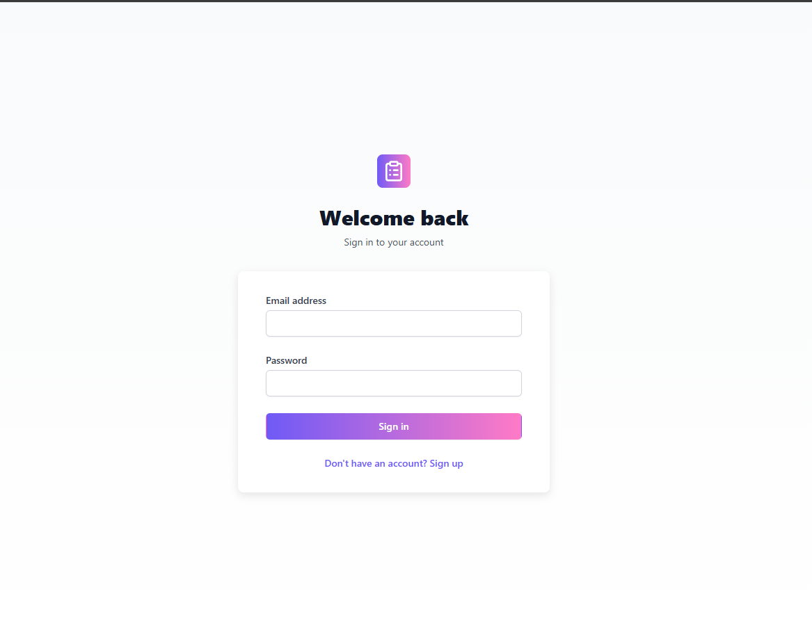
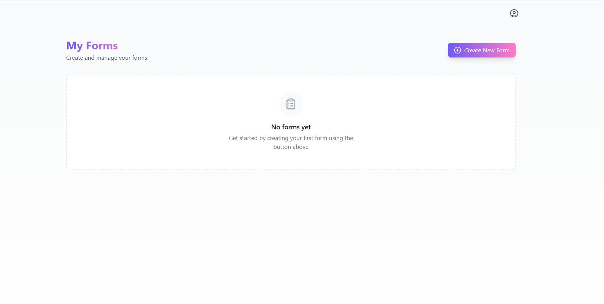
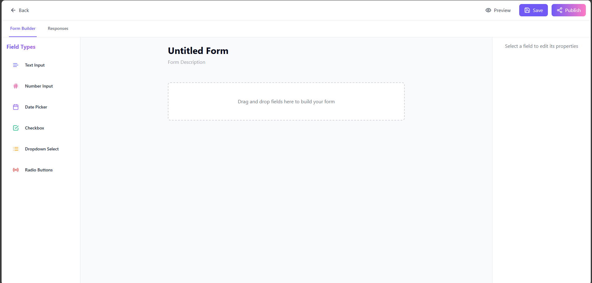
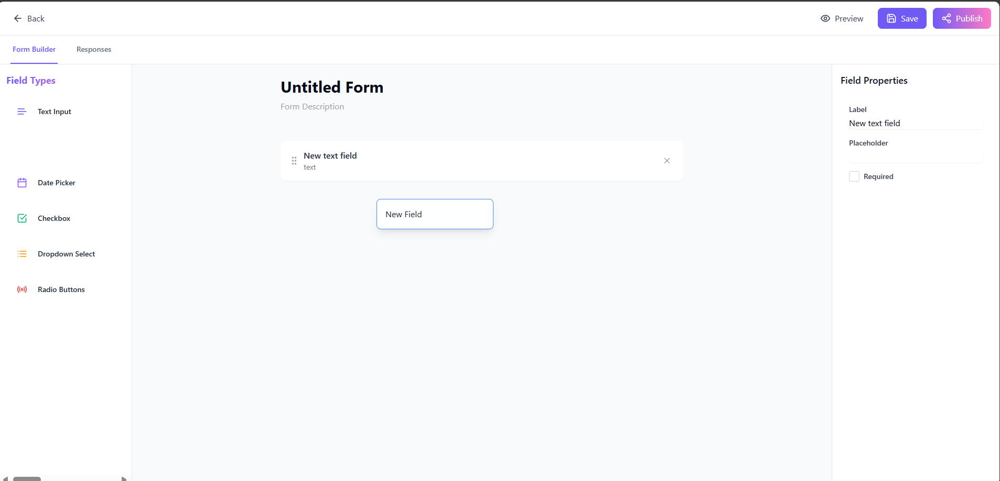
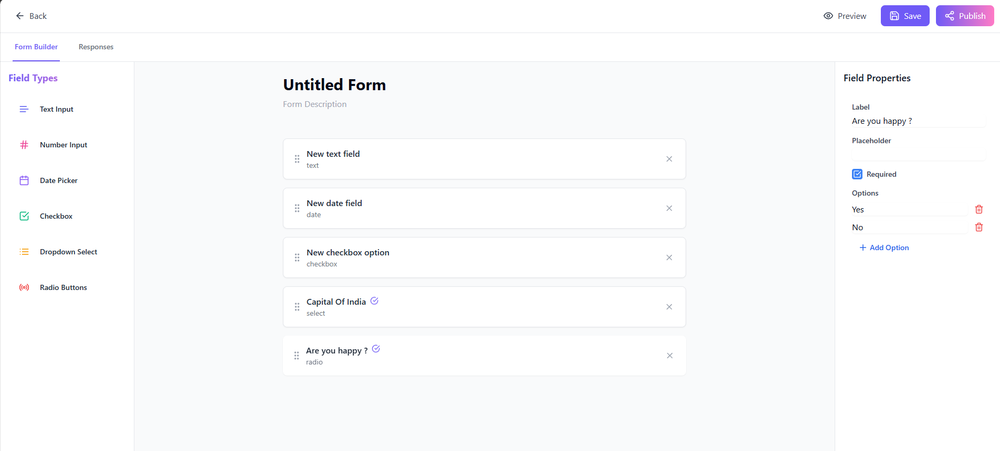
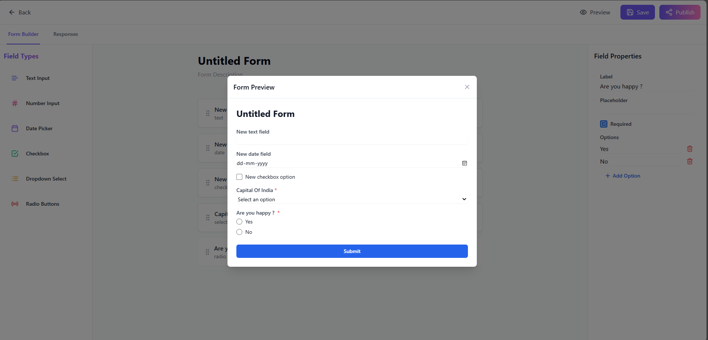
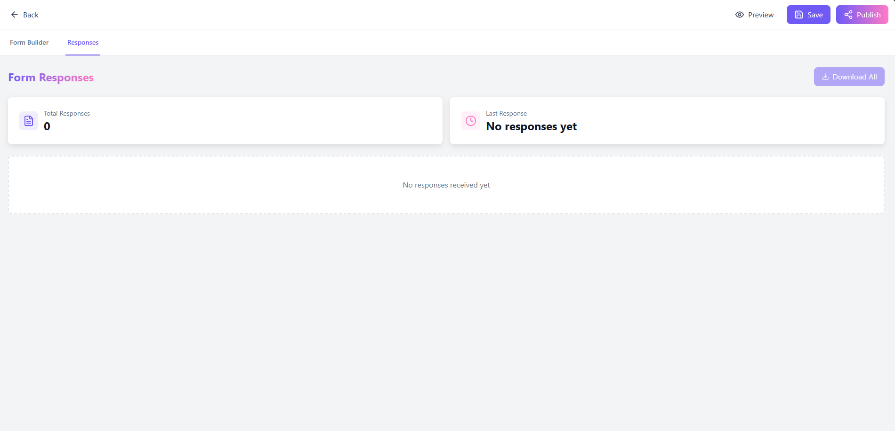
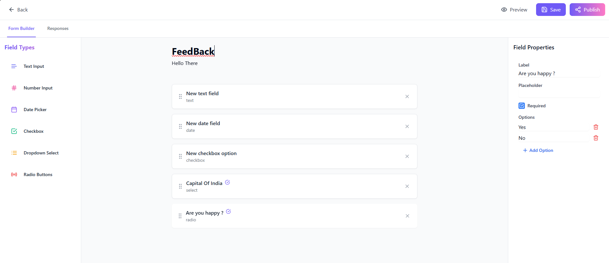
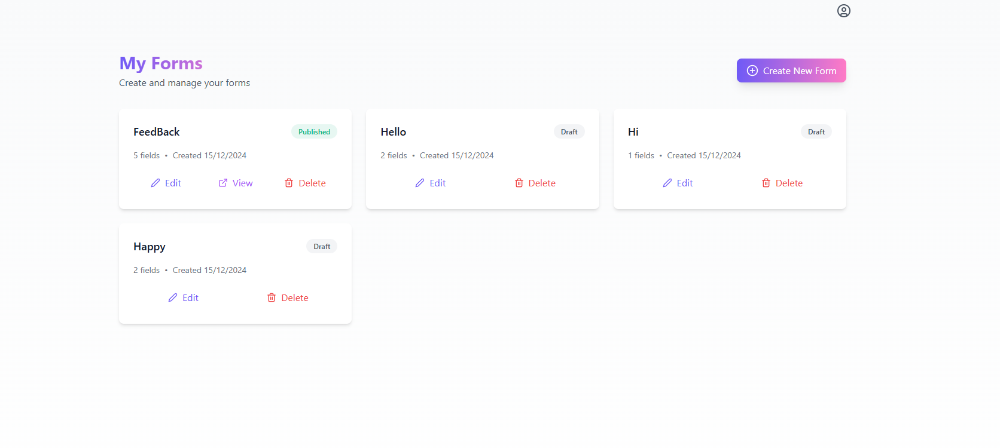

# Custom Form Builder with Drag-and-Drop Functionality

## Table of Contents
- [Introduction](#introduction)
- [Features & Requirements](#features--requirements)
- [Technologies & Tech Stack](#technologies--tech-stack)
- [Installation](#installation)
- [Configuration](#configuration)
- [Database Setup](#database-setup)
- [Running the Application](#running-the-application)
- [API Endpoints](#api-endpoints)
- [Screenshots](#screenshots)

---

## Introduction
The Custom Form Builder is a versatile web application that allows users to create, share, and manage custom forms using a user-friendly drag-and-drop interface. It enables users to easily add various types of form fields, share forms with others, and view the responses submitted.

## Features & Requirements
1. **Form Builder**:
   - Drag-and-drop functionality to add form fields.
   - Supported field types: Text Input, Number Input, Date Picker, Checkbox, Dropdown Select, Radio Buttons.
   - Field properties customizable (label, placeholder, required/optional, default value).
   - Ability to reorder and remove fields.
   - Customizable form title and description.

2. **Form Sharing**:
   - Save created forms and generate unique shareable links.

3. **Form Submission**:
   - Users can submit their responses, which are stored in a database.
   - Form creators can view submissions and export them as a CSV file.

4. **Frontend Features**:
   - A dashboard to view, edit, and delete forms, along with submission stats.
   - Responsive design for different screen sizes.

5. **Backend & API**:
   - API for form management and submissions.
   - Unique link generation for forms.

## Technologies & Tech Stack
- **Frontend**: React, Redux, Tailwind CSS
- **Backend**: Node.js, Express.js
- **Database**: PostgreSQL
- **Authentication**: JWT
- **Version Control**: Git

## Installation

1. Clone this repository:
   ```bash
   git clone https://github.com/yourusername/custom-form-builder.git
   cd project
   ```

2. Install dependencies for both frontend and backend:
   ```bash
   npm install

   ```

## Configuration
Before running the application, you need to set up the environment variables:

1. Generate a JWT secret:
   ```bash
   node -e "console.log(require('crypto').randomBytes(64).toString('hex'))"
   ```

2. Create a `.env` file in the backend folder and populate it:
   ```
   POSTGRES_USER=your_user
   POSTGRES_PASSWORD=your_password
   POSTGRES_HOST=localhost
   POSTGRES_PORT=5432
   POSTGRES_DB=your_database
   JWT_SECRET=your_generated_jwt_secret
   VITE_API_URL=http://localhost:5000
   FRONTEND_URL=http://localhost:5173
   ```

## Database Setup
To set up the PostgreSQL database,Create Databse with name `formbuilder` and run the following SQL commands in the PostgreSQL query tool:

```sql
CREATE TABLE users (
    id SERIAL PRIMARY KEY,
    username VARCHAR(50) UNIQUE NOT NULL,
    password VARCHAR(255) NOT NULL,
    created_at TIMESTAMP DEFAULT CURRENT_TIMESTAMP
);

CREATE TABLE forms (
    id SERIAL PRIMARY KEY,
    user_id INT REFERENCES users(id),
    title VARCHAR(255) NOT NULL,
    description TEXT,
    created_at TIMESTAMP DEFAULT CURRENT_TIMESTAMP
);

CREATE TABLE form_fields (
    id SERIAL PRIMARY KEY,
    form_id INT REFERENCES forms(id),
    field_type VARCHAR(50) NOT NULL,
    label VARCHAR(255) NOT NULL,
    placeholder VARCHAR(255),
    required BOOLEAN DEFAULT FALSE,
    default_value TEXT
);

CREATE TABLE submissions (
    id SERIAL PRIMARY KEY,
    form_id INT REFERENCES forms(id),
    submission_data JSONB,
    submitted_at TIMESTAMP DEFAULT CURRENT_TIMESTAMP
);
```

## Running the Application
After installing the dependencies and configuring the environment variables, you can start both the frontend and backend:

1. Start the backend server:
   ```bash
   cd server
   npm run dev:server
   ```

2. In another terminal, start the frontend server:
   ```bash
   npm run dev
   ```

## API Endpoints
- **GET /api/forms**: Retrieve all forms for the user.
- **POST /api/forms**: Create a new form.
- **GET /api/forms/:id**: Retrieve form details by ID.
- **POST /api/forms/:id/submissions**: Submit a response for a form.
- **GET /api/forms/:id/submissions**: Fetch submissions for a specific form.
- **GET /api/forms/:id/export**: Export submissions in CSV format.

## Screenshots
Here are some screenshots of the website's user interface:

1. **User Authentication**
   

2. **Form Builder Dashboard**
   

3. **Creating a New Form**
   

4. **Drag and Drop Functionality**
   

5. **Field Properties Configuration**
   

6. **Form Preview**
   

7. **Responses Page**
   

8. **Editing Form Title**
   

9. **Updated Dashboard with Stats**
   
